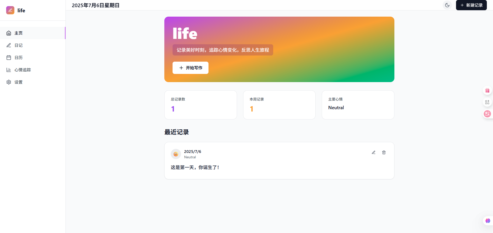

# 日常生活记录器 (Daily Life Recorder)

一个现代化的、响应式的日常生活记录应用，帮助您记录生活的美好时刻、追踪心情变化，并反思人生旅程。


## 🌟 功能特性

### 核心功能
- **📝 日记记录** - 轻松记录您的日常生活和想法
- **📖 Markdown支持** - 支持Markdown语法，让您的日记更加丰富多彩
- **👀 预览功能** - 编辑时可实时切换预览模式查看渲染效果
- **😊 心情追踪** - 选择不同的心情状态（惊喜、开心、平静、悲伤、糟糕）
- **📅 日历视图** - 在日历上查看您的记录历史
- **📊 心情分析** - 可视化您的心情趋势和分布
- **🔍 智能搜索** - 快速找到您想要的记录

### 用户体验
- **🌙 深色模式** - 支持明亮和深色两种主题
- **📱 响应式设计** - 完美适配桌面和移动设备
- **💾 自动保存** - 数据自动保存到本地存储
- **📤 数据导出** - 支持导出和导入数据备份
- **🎨 现代UI** - 美观的界面设计和流畅的动画效果

## 🛠️ 技术栈

- **React 18** - 现代化的前端框架
- **TypeScript** - 类型安全的JavaScript
- **Tailwind CSS** - 实用优先的CSS框架
- **Vite** - 快速的构建工具
- **Lucide React** - 美观的图标库
- **React Markdown** - Markdown渲染支持
- **Local Storage** - 本地数据存储

## 📦 安装步骤

### 前提条件
- Node.js (版本 16 或更高)
- npm 或 yarn

### 1. 克隆或下载项目
```bash
# 如果是从Git仓库克隆
git clone <repository-url>
cd daily-life-recorder

# 或者直接使用现有的项目文件夹
cd python/2025_07/dailylife
```

### 2. 安装依赖
```bash
npm install
```

### 3. 启动开发服务器
```bash
npm run dev
```

### 4. 打开浏览器
访问 `http://localhost:3000` 查看应用

## 🚀 使用方法

### 创建第一条记录
1. 点击右上角的 "新建记录" 按钮
2. 选择您当前的心情状态
3. 在文本框中写入您的想法或发生的事情
4. 点击 "保存记录" 完成创建

### 使用Markdown格式化
您可以使用Markdown语法来美化您的日记内容：

```markdown
# 今天的重要事件
## 上午
- 完成了重要的工作项目
- 与朋友**聊天**很开心

## 下午
> 今天的天气真好，适合出去散步

学习了新的技能：`JavaScript`编程

[查看更多](https://example.com)
```

- 点击 "预览" 按钮可以实时查看Markdown渲染效果
- 点击 "编辑" 按钮返回编辑模式
- 支持标题、粗体、斜体、代码、链接、引用等格式

### 查看和管理记录
- **主页**：查看最近的5条记录和统计信息
- **日记页**：查看所有记录的完整列表
- **日历页**：在日历视图中查看按日期分布的记录
- **心情追踪**：查看心情分布统计和最近7天的心情趋势

### 编辑和删除记录
- 点击记录卡片上的编辑图标来修改记录
- 点击删除图标来删除不需要的记录

### 主题切换
- 点击右上角的月亮/太阳图标切换深色/浅色主题

### 数据备份
1. 进入设置页面
2. 点击 "导出数据" 下载备份文件
3. 使用 "导入数据" 恢复之前的备份

## 📁 项目结构

```
daily-life-recorder/
├── public/                 # 静态资源
├── src/
│   ├── daily-life-recorder.tsx  # 主应用组件
│   ├── main.tsx           # 应用入口点
│   └── index.css          # 全局样式
├── package.json           # 项目配置和依赖
├── index.html            # HTML模板
├── vite.config.ts        # Vite配置
├── tsconfig.json         # TypeScript配置
├── tailwind.config.js    # Tailwind CSS配置
└── README.md             # 项目说明文档
```

## 🔧 开发指南

### 可用的命令
```bash
# 启动开发服务器
npm run dev

# 构建生产版本
npm run build

# 预览构建结果
npm run preview
```

### 主要组件说明

#### AppProvider
- 应用的全局状态管理
- 处理数据的存储和读取
- 提供上下文给所有子组件

#### Navigation
- 左侧导航栏组件
- 支持收缩/展开
- 响应式设计

#### Header
- 顶部头部组件
- 包含日期显示、主题切换、新建记录按钮

#### EntryCard
- 记录卡片组件
- 显示单条记录的内容
- 支持编辑和删除操作

#### EntryModal
- 创建/编辑记录的模态框
- 心情选择和内容编辑

### 数据结构

```typescript
interface Entry {
  id: string;        // 唯一标识符
  date: string;      // 创建日期
  content: string;   // 记录内容
  mood: string;      // 心情状态
}

interface Settings {
  theme: 'light' | 'dark';      // 主题
  autoSave: boolean;            // 自动保存
  showMoodOnCalendar: boolean;  // 日历显示心情
}
```

## 🎨 自定义样式

项目使用 Tailwind CSS，您可以通过以下方式自定义样式：

1. **修改颜色主题**：编辑 `tailwind.config.js` 中的颜色配置
2. **添加自定义样式**：在 `src/index.css` 中添加自定义CSS
3. **修改组件样式**：直接在组件中修改Tailwind类名

## 🔒 数据安全

- 所有数据都存储在浏览器的本地存储中
- 不会上传到任何服务器
- 支持数据导出备份，防止数据丢失
- 清除浏览器数据会删除所有记录

## 🐛 常见问题

### Q: 页面无法加载或显示空白
A: 检查是否正确安装了所有依赖，尝试重新运行 `npm install`

### Q: 记录数据丢失了
A: 数据存储在浏览器本地存储中，清除浏览器数据会导致丢失。建议定期导出备份。

### Q: 如何更改语言？
A: 目前应用主要支持中文，如需其他语言，需要修改组件中的文本内容。

### Q: 在移动设备上使用体验如何？
A: 应用采用响应式设计，在移动设备上同样有良好的使用体验。

## ✅ 已完成功能

- [x] **Markdown支持** - 支持丰富的文本格式化
- [x] **预览功能** - 实时预览Markdown渲染效果
- [x] **搜索和过滤** - 智能搜索日记内容
- [x] **数据可视化** - 心情统计和趋势图表
- [x] **自定义文本** - 个性化应用界面文本

## 🔮 未来功能计划

- [ ] 云端同步功能
- [ ] 更多心情选项和自定义心情
- [ ] 图片上传和附件支持
- [ ] 标签和分类功能
- [ ] 代码高亮支持
- [ ] 表格和列表增强
- [ ] 多语言支持
- [ ] 移动端PWA支持

## 📄 许可证

本项目采用 MIT 许可证 - 查看 [LICENSE](LICENSE) 文件了解详情。

## 🤝 贡献

欢迎提交 Pull Request 和 Issue！

1. Fork 本项目
2. 创建你的特性分支 (`git checkout -b feature/AmazingFeature`)
3. 提交你的修改 (`git commit -m 'Add some AmazingFeature'`)
4. 推送到分支 (`git push origin feature/AmazingFeature`)
5. 打开一个 Pull Request

## 📞 联系方式

如有任何问题或建议，请通过以下方式联系：

- 创建 Issue
- 发送邮件到 [your-email@example.com]

---

**享受记录生活的乐趣！** ✨ 